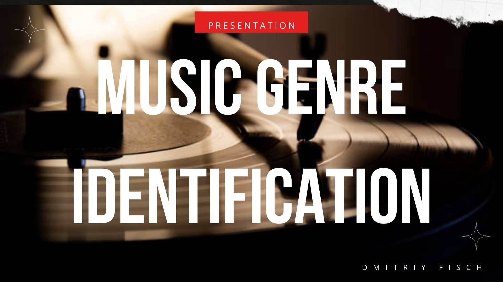
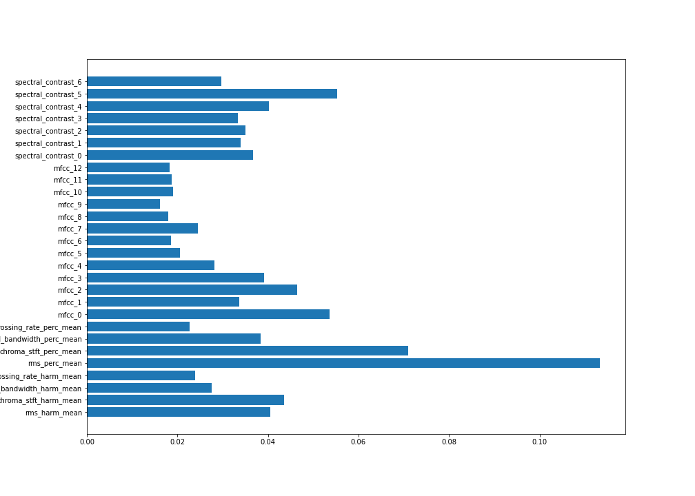
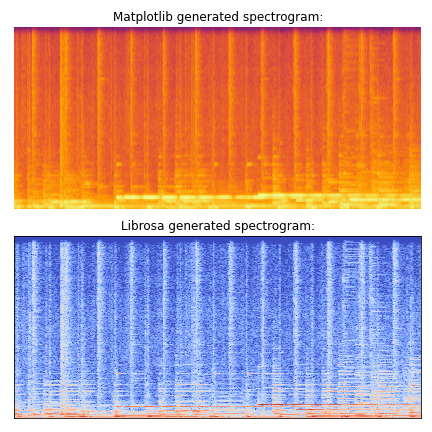
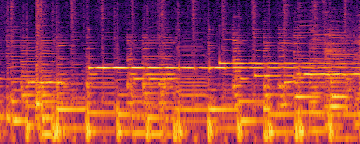
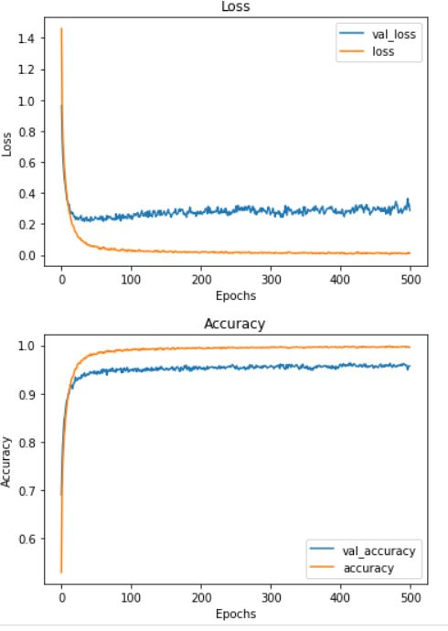
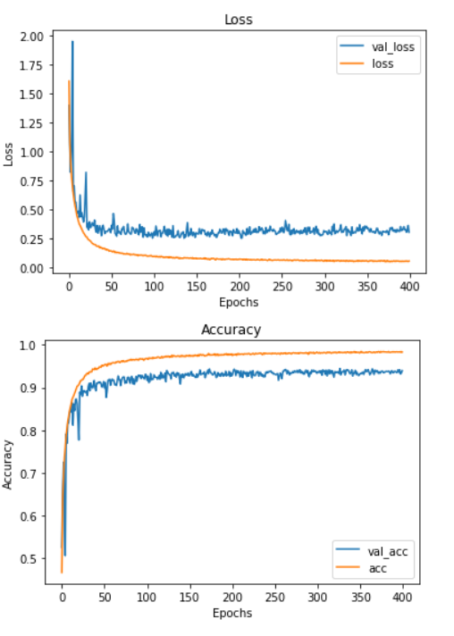
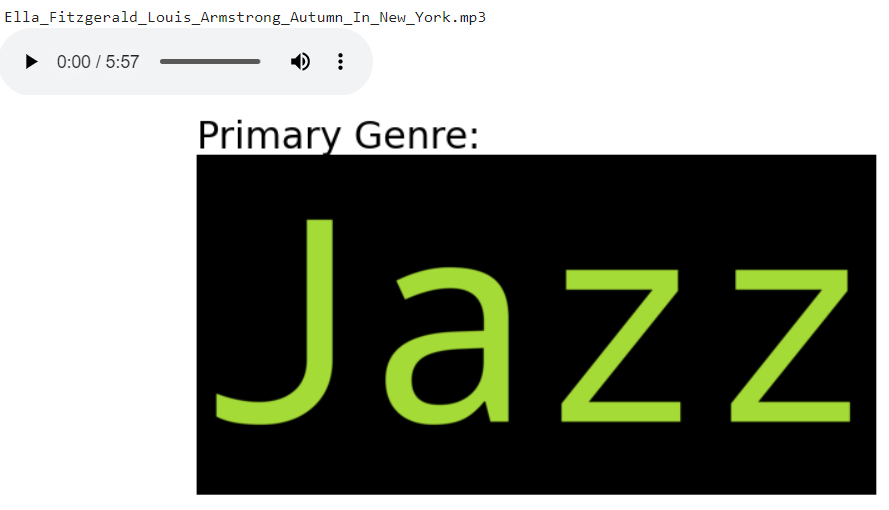
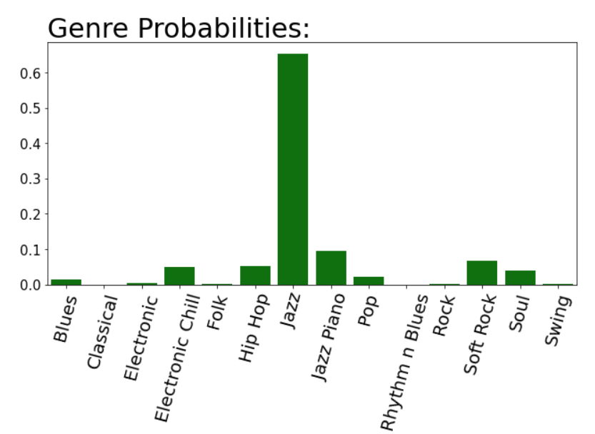
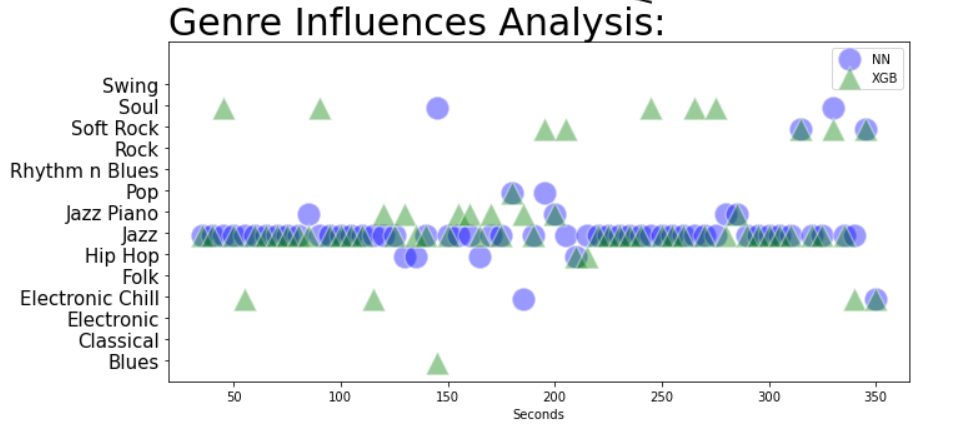

# GetYourMusicStyle Classifier


```python
from IPython.display import Image
Image("pictures/1.jpg")
```


    

    


Being a musician and a music lover gave me some necessary domain knowledge to create this concept prooving project:

* You are at a live performance and would like to find music of  the same genre?
* Your friend just recorded a cool demo and you want to find similar bands?
* You are  trying to identify a recording they play in a coffee shop, but Shazam cannot find it,  
and you are interested in discovering something  that sounds alike?

## Objectives:

The goal of this effort is to create a tool that:
* performs music genre classification
* displays visualization of genre influences and how the probabilities of various genres distributed for the duration of a sample
* recommends music of the same genre
***

1. ### DATA UNDERSTANDING and DATASET PREPARATION

2. ### IDENTIFYING and EXTRACTING FEATURES

 - **features for regular NN as well as XGBoost**
 - **images for CNN  (spectragrams)**

3. ### MODELS

4. ### CLASSIFICAITON TOOL BASED ON MOST SUCCESFUL MODEL(S)

5. ### PROOF OF CONCEPT DEMO RECOMMENDATION SYSTEM

6. ### REPRODUCIBILITY REQUIREMENTS


***
## 1. DATA UNDERSTANDING and DATASET PREPARATION
***

* One of the significant challenges of this project was getting a good training dataset with proper genre labels. The standard option was the GTZAN music dataset, which is the most-used public dataset for evaluation in machine listening research for music genre recognition. But as mentioned in a [paper by Bob L. Sturm
](https://arxiv.org/pdf/1306.1461v2.pdf) it has significant faults: genres are mislabeled, lots of repetetions, only 1000 samples based on less than 300 songs, noisy recordings, etc. After exploring the dataset, I decided to avoid using it and ended up creating my own dataset based on my own music collection as well as some publically available Youtube mixes/lists.  

* Almost 2,000 recorded musical pieces of 14 genres were selected

* The model was trained on the following genres:

       'Blues', 'Classical', 'Electronic', 'Electronic Chill', 'Folk',
       'Hip Hop', 'Jazz', 'Jazz Piano', 'Pop', 'Rhythm n Blues', 'Rock',
       'Soft Rock', 'Soul', 'Swing'
    
    
* Each raw music file was cut in 30 second chunks totalling to 4,700 sample files. On average 2-3 chunks per each of the 2000 music pieces are included in the dataset
  
  
* The first 30 seconds of each file were skipped to exclude intros.
  
  
* Only the most representative excerpts were selected to make sure that dataset consists of typical genres examples as much as possible  
  
  
* The detailed code of the dataset creation is beyond the scope of this repository. In the future I plan to add more genres and selections.


***  
## 2. IDENTIFYING AND EXTRACTING FEATURES


***
* A detailed feature exploration and visualizations are included in 'EDA and Features Exploring.ipynb'  


* src/generate_features.py script (takes several hours to execute) was used to generate features and spectrograms (see the details below)  


* Here are some key points for feature extractions:

### Two Approaches:

After an initial load of an audio file:  **x , sr = librosa.load(audio_file)** :

1. **Numeric Features extraction:** Using various transformations over **x** extract chosen features and store them in a CSV file together with the genre labels. This CSV file will be used in model training (regular NN or models like XGBoost)  


2. **Spectrograms generation:** Instead of extracting numeric features, we can generate a spectrogram image of a sound. Such spectrogram visualizes the signal strength over time at various frequencies. A model can be trained directly using images/spectrograms (good for CNN network training) 

#### 1. Numeric Feature Extraction


* librosa library was used for feature extraction


* Initially 7 characteristics were chosen: rmse, chroma_shft, central_centroid, central_rolloff, central_bandwidth, Zero Crossing Rate, and 20 mfcc channels. Also cqt and tonnets were considered.  


* After several iterations of testing the following was chosen:  
* * 13 mfcc channels, 7 spectral_contrasts channels,  
* * the  means of: spectral_bandwidth, zero_crossing_rate, chroma_shft, and rmse for both harmonic and percussive wave split.  

Below is a full feature list and their importance report (as generated by XGBoost model at a later modeling stage):


```python
Image("pictures/output_EDA/feature_importance.png")
```


    

    


#### 2. Spectrogram Images generation:


```python

Image('pictures/output_EDA/spectrograms1.png')
```


    

    


For CNN model after trying different spcectrograms visualizations  
log transformations were performed in librosa to make it more readable for CNN model:  
* librosa.display.specshow(ampl, x_axis='time',  y_axis='log')  


```python
Image("pictures/output_EDA/log_spectrograms2.png")
```


    

    


***
# 3. MODELING
***

* Three notebooks  (XGB.ipynb, NN.ipynb, CNN.ipynb) have all the training/evaluation details

Quick Overview of the process:

## XGB and NN models

* The features/features.csv file - is used to load features/target for training/evaluating  


* OPTIONALLY: features.csv can be regenerated by running src/generate_features.py (uncomment: extract = 'FEATURES' at the top of the script)  might takes several hours to complete the process  


* Accuracy of 96% (for NN model) and 92% (for XGBooster model) is achieved  (please check corresponding notebooks for the details)

Here is training process for NN: 
**Further details about modeling are in corresponding XGB.ipynb and NN.ipynb notebooks**


```python
Image("pictures/output_EDA/learning curve NN.JPG")
```


    

    


## CNN model

* GPU enironment in Google Collab was used for training  

* OPTIONALLY: all the images can be regenerated by running src/generate_features.py (uncomment: extract = 'IMAGES' at the top of the script)  

* (100 x 100, 23,000+ images,  6 seconds span  

* Best models are saved in models folder

* Accuracy of 94% (for CNN) was achieved. Further improvements are possible if adding more samples.


```python
Image("pictures/output_EDA/CNN Training.PNG")
```


    

    


4. ### CLASSIFICAITON TOOL BASED ON MOST SUCCESFUL MODEL(S)

* Please see "Classifiy and recommend.ipynb" notebook , that is an actual classification implementation (notebooks/app) 
* The app uses NN and XGB as joined classifiers - and has the best accuracy
* Another version "Classifiy and recommend v2.ipynb" notebook uses all three (NN/XGB/CNN) models but is still under development
* below are sample screenshots:


```python
Image("pictures/output_pictures/Genre Analysis with GetYourMusicStyle3.PNG")
```


    

    


```python
Image("pictures/output_pictures/Genre Analysis with GetYourMusicStyle2.PNG")
```


    

    


```python
Image("pictures/output_pictures/Genre Analysis with GetYourMusicStyle.PNG")
```


    

    


5. ### PROOF OF CONCEPT DEMO RECOMMENDATION SYSTEM

* The actual recommendation system is beyond the scope of this repository, but as a proof of concept, 3 songs of a similar genre will be printed 


6. ### REPRODUCIBILITY REQUIREMENTS

* Please note that not all Notebooks/python scripts are fully reproducible yet and I have several action items to take care off:

1. In order to let anybody re-generate spectrogramms/features from the audio files dataset I will have to make sure that it's ok to load audio on kaggle (copyright issues?) and provide instructions how to download it (datasets are too large to host on github)

2. I will also upload spectrogram images dataset to kaggle and make it available for downloads.

3. It's possible to load models, evaluate them and use them for prediction. Classificaiton tool should be fully operational as well. However detailed requirements.txt is not ready yet (current versions of pysox, librosa, ffmpeg, pydub, keras, sklearn, xgboost, etc are needed, and I will provide exact requirements)
